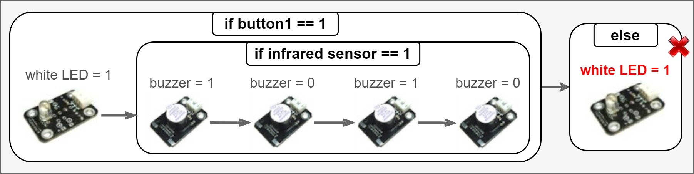

# Automatic Test Amplification for Executable Models
This repository contains the tool and the evaluation data of the following paper:

Faezeh Khorram, Erwan Bousse, Jean-Marie Mottu, Gerson Sunyé, Pablo Gómez-Abajo, Pablo C.Cañizares, Esther Guerra, and Juan de Lara. 2022. Automatic Test Amplification for Executable Models. In *ACM/IEEE 25th International Conference on Model Driven Engineering Languages and Systems*, October 23–28, 2022, Montreal, Canada.

The paper is recently accepted and a link to it will be provided soon.

## Introduction
Behavioral models are important assets that must be thoroughly verified early in the design process. This can be achieved with manually-written test cases that embed carefully hand-picked domain-specific input data. 
In our previous work, we proposed a testing framework providing facilities to write, execute, debug, and analyze test cases for behavioral models [[1]](https://hal.archives-ouvertes.fr/hal-03723920) ([Link to the tool](https://gitlab.univ-nantes.fr/naomod/faezeh-public/xtdl))

Manually-written test cases may not always reach the desired level of quality, such as high coverage or being able to localize faults efficiently. *Test amplification* is an interesting emergent approach to improve a test suite by automatically generating new test cases out of existing manually-written ones. 
There are ad-hoc test amplification solutions for a few programming languages, such as DSpot for Java [[2]](https://github.com/STAMP-project/dspot/).

In this work, we propose an automated and generic approach for amplifying the test cases of behavioral models. Given an executable DSL, a conforming behavioral model, and an existing test suite, the proposed approach generates new regression test cases in three steps: 
(i) generating new test inputs by applying a set of generic modifiers on the existing test inputs; 
(ii) running the model under test with new inputs and generating assertions from the execution traces; and 
(iii) selecting the new test cases that increase the mutation score. 

    

This repository contains our test amplification tool built atop the Eclipse GEMOC Studio.
We also performed an empirical study of the tool and all the materials are provided in this repository. In the experiment, we applied the approach to 71 test suites written for models conforming to two different DSLs, and for 67 of the 71 cases, it successfully improved the mutation score between 3.17% and 54.11% depending on the initial setup.

## Overview
1.	*AmplificationTool*: 
- the eclipse plugins of our test amplification tool: `org.imt.tdl.amplificaiton`, `org.imt.tdl.mutation`
- the plugins of our testing framework that are required for the amplification tool (To access the latest version of them, use the [main repository](https://gitlab.univ-nantes.fr/naomod/faezeh-public/xtdl)).
2.	*xdsls*: the implementation of two Executable Domain-Specific Languages (xDSLs) of our case study, including *xPSSM* and *xArduino*. The implementation of each involves five projects:

- <u>Abstract Syntax</u>: containing the `Ecore` metamodel of the xDSL and the java code generated from it using the `.genmodel` file
- <u>Operational Semantics</u>: containing the interpreter of the xDSL implemented in `Xtend`
- <u>Behavioral Interface</u>: containing a `.bi` file that is the interface of the xDSL and a java class that do the setups, so GEMOC engines can find and use the interface 
- <u>Executable DSL</u>: containing a `.dsl` file which specifies the name of the xdsl, the path to the `.ecore` file, the list of execution rules of the interpreter, and the id of the behavioral interface project
- <u>Mutation Operators</u>: containing a `.mutator` file which includes the mutation operators defined for the xDSL using [WODEL language](https://gomezabajo.github.io/Wodel/)

3.	*xmodels&tests*: the executable models conforming to each xDSL, a set of mutants generated for each of them (by applying the provided mutation operators using WODEL mutant generator), and a test project containing a manually-written test suite and the test amplification result including the mutation analysis report, the amplified test suite, and the test amplification report.

4.	Two Excel files containing detailed data of the paper’s evaluation

## Setup
**Requirements**: 
- Java 16
- GEMOC Studio Version 3.5.0: https://gemoc.org/download.html
- TDL: https://tdl.etsi.org/eclipse/latest/

After downloading GEMOC Studio, unzip the folder and run it:
1.	Run `GemocStudio` application

    

2.	It asks for a workspace, either select an existing workspace or a new folder, then select `Launch`

    

3.	You need to install TDL using the provided update site. To do this, go to the `Help` menu and select `Install new Software`. Add the TDL update site and click on `Next`. Accept the license and follow the steps. At the end, it asks to restart the workspace.
 
 
4.	An empty workspace will be shown. Import the projects from the AmplificationTool directory using `Import projects` option shown in the Project Explorer or by following: File -> Import -> Existing Projects into Workspace -> Select Root Directory (browse to the *AmplificationTool* directory) -> Select Folder -> Finish

    

  
**NOTE**: In our case study, we experimented our tool on two xDSLs. In this document, we will show how to run the experiment for xArduino as it was also the running example of the paper. Nevertheless, you can follow the same steps for the xPSSM.

## Usage
1.	Import the xArduino implementation from the `xdsls/xArduino` directory in the same way described in the previous step. At the end, your project explorer should be as following picture:

    

2. To deploy the tool and the xArduino DSL, we should run this workspace using `Eclipse Application` run configuration. To do this, follow: Run -> Run Configurations, then choose `Eclipse Application` from the list of available configurations and double click to create an instance of it. You can optionally change the default name of the configuration. Finally, press `Run` to open a new Eclipse instance.

    

3. In the new Eclipse instance, import the projects from the `xmodels&tests` directory. Here, we imported the projects related to the running example of the paper:
- `Arduino.RunningExample` project containing:

    a) `runningExample.model`: a sample Arduino model 
    

    

    b) `mutants/cic.output0.model`: a mutant generated for the Arduino model
    

    

- `Arduino.RunningExample_Test` project containing:

    a)	`testSuite.tdlan2`: a test suite for the model that indeed has one test case briefly drawn in the following Figure and completely shown in the next tool screenshot using TDL textual syntax 
    
    

        
    

    b)	`testSuite_mutationReport.txt`: the result of performing mutation analysis on the provided test suite
    
    c)	`testSuite_amplified.tdlan2`: the amplified test suite generated by the tool which contains two test cases, the given test case (a) and one generated test case that improves the mutation score of the given test suite
    
    

        
    

    d) `testSuite_amplificationReport.txt`: the test amplification result 
    

**NOTE**: The three files explained in (b), (c), and (d) are indeed the output of our amplification tool. We provided them here to be used during the evaluation of the tool, to check if the tool provides what is expected. In the following, we remove them and show how to run the tool.

4. Run the test amplification tool by right click on the input test suite, here `testSuite.tdlan2` file, and selecting `Amplify TDL Test Suite`

5.	When the execution finishes, a message as *“Test Amplification has been performed successfully”* must be shown in the console with a couple of information about the execution result. If the tool were able to generate any new test case, the last message you should see in the console must be *“Phase (4): Saving new test cases”*. By refreshing the test suite project (i.e., right-click on the `Arduino.RunningExample_Test` project and select `Refresh`), the files described above must appear under the project.

## Acknowledgment
This project is funded by the [EU H2020 research project Lowcomote](https://www.lowcomote.eu/).
