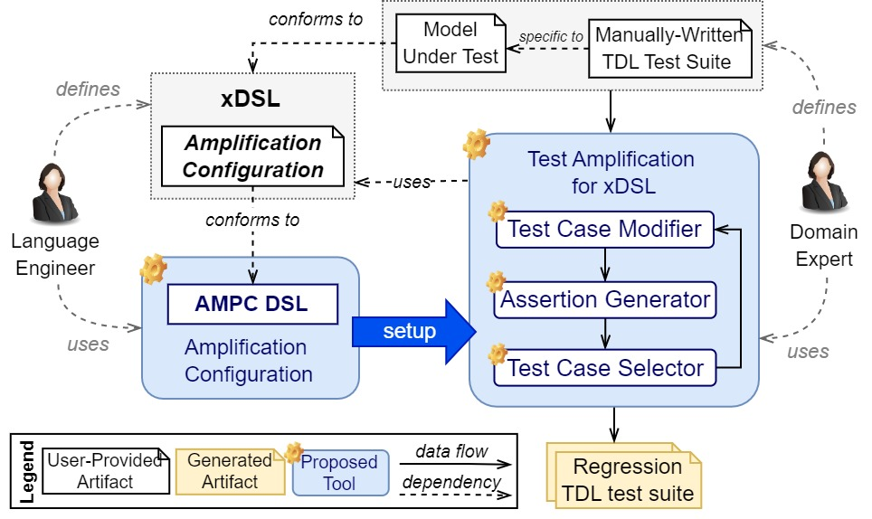
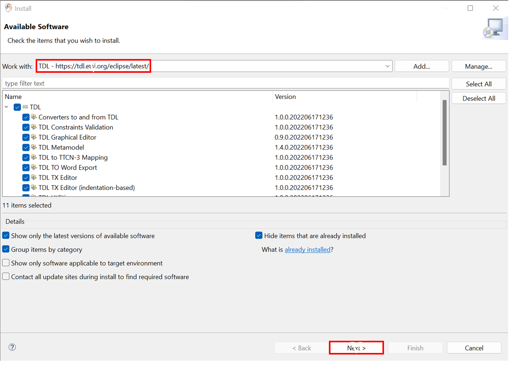
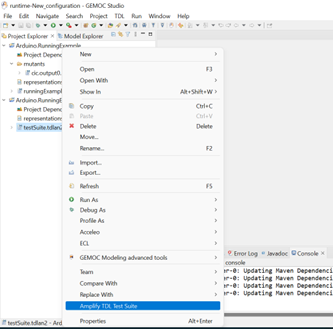

# TAMO: Automatic Test Amplification for Executable Models
This repository contains the tool and the evaluation data of the following paper:

Faezeh Khorram, Erwan Bousse, Jean-Marie Mottu, Gerson Sunyé, Djamel Eddine Khelladi, Pablo Gómez-Abajo, Pablo C.Cañizares, Esther Guerra, and Juan de Lara. 2023. A Language-Parametric Test Amplification Framework for Executable Domain-Specific Languages. Submitted to the International Journal on Software and Systems Modeling (SoSyM) as an extension of our MODELS'22 paper ([link to the paper](https://dl.acm.org/doi/10.1145/3550355.3552451)).

## Introduction
Behavioral models are important assets that must be thoroughly verified early in the design process. This can be achieved with manually-written test cases that embed carefully hand-picked domain-specific input data. 
In our previous work, we proposed a testing framework providing facilities to write, execute, debug, and analyze test cases for behavioral models [[1]](https://hal.archives-ouvertes.fr/hal-03723920) ([Link to the tool](https://gitlab.univ-nantes.fr/naomod/faezeh-public/xtdl)).

Manually-written test cases may not always reach the desired level of quality, such as high coverage or being able to localize faults efficiently. *Test amplification* is an interesting emergent approach to improve a test suite by automatically generating new test cases out of existing manually-written ones. 
There are ad-hoc test amplification solutions for a few programming languages, such as DSpot for Java [[2]](https://github.com/STAMP-project/dspot/).

In this work, we propose an automated and generic process for amplifying the test cases of behavioral models. Given an executable DSL, a conforming behavioral model, and an existing test suite, the proposed approach generates new regression test cases in three steps: 
(i) generating new test inputs by applying a set of generic modifiers on the existing test inputs; 
(ii) running the model under test with new inputs and generating assertions from the execution traces; and 
(iii) selecting the new test cases that increase the initial test quality in terms of both mutation score and coverage. 
We also propose a textual DSL to control and configure the test amplification process.
Moreover, to facilitate the application of mutation analysis, we propose an automatic approach for the generation of mutation operators for a given xDSL.

The proposed test amplification framework for xDSLs:

    

The proposed test amplification process:

    

This repository contains our test amplification tool built atop the Eclipse GEMOC Studio.
We also performed an empirical study of the tool and all the materials are provided in this repository. In the experiment, we applied the approach to 71 test suites written for models conforming to two different DSLs.

## Overview
1.	*Tool*: 
- *amplification_tool*: the plugins of our test amplification tool (`org.imt.tdl.amplificaiton`) and the implementation of the AMPC DSL which is used for the configuration of the test amplification process.
- *testing_tool*: the plugins of our testing framework that are the basis for the amplification tool (To access the latest version of them, use the [main repository](https://github.com/lowcomote/Testing4DSLs)).
- *coverage_tool*: the plugins for the model element coverage computation
- *mutation_tool*: the plugins for the mutation analysis 
2.	*xdsls*: the implementation of two Executable Domain-Specific Languages (xDSLs) of our case study, including *xPSSM* and *xArduino*. The implementation of each involves five projects:

- <u>Abstract Syntax</u>: containing the `Ecore` metamodel of the xDSL and the java code generated from it using the `.genmodel` file
- <u>Operational Semantics</u>: containing the interpreter of the xDSL implemented in `Xtend`
- <u>Behavioral Interface</u>: containing a `.bi` file that is the interface of the xDSL and a java class that do the setups, so GEMOC engines can find and use the interface 
- <u>Executable DSL</u>: containing a `.dsl` file which specifies the name of the xdsl, the path to the `.ecore` file, the list of execution rules of the interpreter, and the id of the behavioral interface project
- <u>Coverage rules</u>: containing a '.cov' file which specializes the coverage computation for the xDSL
- <u>Mutation Operators</u>: containing a `.mutator` file which includes the mutation operators defined for the xDSL using [WODEL language](https://gomezabajo.github.io/Wodel/)

 **NOTE**: Currently, we do not provide any graphical syntax for the xDSLs.

3.	*xmodels&tests*: the executable models conforming to each xDSL, a set of mutants generated for each of them (by applying the provided mutation operators using WODEL mutant generator), and a test project containing a manually-written test suite and the test amplification result including the mutation analysis report, the amplified test suite, and the test amplification report.

4.	*evaluationResult*: Excel files containing detailed data of the paper’s evaluation and the result of our evaluation for RQ4. 

## Setup
**Requirements**: 
- Operating System: Windows 10
- Java 11
- GEMOC Studio Version 3.5.0: https://gemoc.org/download.html
- TDL: https://tdl.etsi.org/eclipse/latest/

After downloading GEMOC Studio, unzip the folder and run it:
1.	Run `GemocStudio` application

    

        
    

    If it shows an error related to the incompatible java versions, you need to edit the `.ini` file (the `GemocSudio configuration settings` file as shown in the above picture under the `GemocStudio application`) and add the path of your installed java using `-vm` key right before the `-vmargs` key. For example,
    
        -vm
        C:/Program Files/Java/jdk-16.0.2/bin/javaw.exe
        -vmargs
        ...

2.	It asks for a workspace, either select an existing workspace or a new folder, then select `Launch`

    

3.	You need to install TDL using the provided update site. To do this, go to the `Help` menu and select `Install new Software`. Add the TDL update site and click on `Next`. Accept the license and follow the steps. At the end, it asks to restart the workspace.

    

        
    

    
    You may receive an error as "Cannot perform the operation" for two plugins: `converters to/from TDL` and `TDL graphical editor`. In this case, Eclipse will suggest skipping their installation and installing everything else. You can continue with this option as these two plugins are not necessary for our test amplification tool.

4.	An empty workspace will be shown. Import the projects from the AmplificationTool directory using `Import projects` option shown in the Project Explorer or by following: File -> Import -> Existing Projects into Workspace -> Select Root Directory (browse to the *AmplificationTool* directory) -> Select Folder -> Finish

    

  
**NOTE**: In our case study, we experimented our tool on two xDSLs. In this document, we will show how to run the experiment for xArduino as it was also the running example of the paper. Nevertheless, you can follow the same steps for the xPSSM.

## Usage
1.	Import the xArduino implementation from the `xdsls/xArduino` directory in the same way described in the previous step. At the end, your project explorer should be as following picture:

    

2. To deploy the tool and the xArduino DSL, we should run this workspace using `Eclipse Application` run configuration. To do this, follow: Run -> Run Configurations, then choose `Eclipse Application` from the list of available configurations and double click to create an instance of it. You can optionally change the default name and the `workspace data location` of this configuration instance. Finally, press `Run` to open a new Eclipse instance.

    

        
    

    **Note**: The `workspace data location` defines the path to the workspace of the newly opened Eclipse instance.  

3. In the new Eclipse instance, import those projects from the `xmodels&tests` directory that you would like to try the tool for them. Here, we imported the projects related to the running example of the paper from the `XArduino-data` directory as follows:
- `Arduino.RunningExample` project containing:

    a) `runningExample.model`: a sample Arduino model
    
    

        
    

    **NOTE**: Please note that `runningExample.model` is an XMI file and there is no graphical model in the `Arduino.RunningExample` project such as the one shown in the above figure. We use the above figure just to make it more understandable for this tutorial. 
    To open the model using Tree editor, right click on the `runningExample.model` file, Open with -> Other -> Sample Reflective Ecore Model Editor -> OK

    b) `mutants/cic.output0.model`: a mutant generated for the Arduino model
    
    

        
    

- `Arduino.RunningExample_Test` project containing:

    a)	`testSuite.tdlan2`: a test suite for the model that indeed has one test case briefly drawn in the following Figure and completely shown in the next tool screenshot using TDL textual syntax 
    
    

        
    

    b)	`testSuite_mutationReport.txt`: the result of performing mutation analysis on the provided test suite
    
    c)	`testSuite_amplified.tdlan2`: the amplified test suite generated by the tool which contains two test cases, the given test case (a) and one generated test case that improves the mutation score of the given test suite
    
    

        
    

    d) `testSuite_amplificationReport.txt`: the test amplification result 
    

        
    

    **NOTE**: The three files explained in (b), (c), and (d) are indeed the output of our amplification tool. We provided them here to be used during the evaluation of the tool, to check if the tool provides what is expected. In the following, we remove them and show how to run the tool.

4. Run the test amplification tool by right click on the input test suite, here `testSuite.tdlan2` file, and selecting `Amplify TDL Test Suite`

        

5.	When the execution finishes, a message as *“Test Amplification has been performed successfully”* must be shown in the console with a couple of information about the execution result. If the tool were able to generate any new test case, the last message you should see in the console must be *“Phase (4): Saving new test cases”*. By refreshing the test suite project (i.e., right-click on the `Arduino.RunningExample_Test` project and select `Refresh`), the files described above must appear under the project.

    

**NOTE**: We just figured out that there is a small issue in the latest version of TDL textual syntax which causes some syntactical errors in the generated amplified test suites (all the errors can be resolved by surrounding the related fields with quotation marks). We reported this issue to the TDL developers ([link to the reported issue](https://labs.etsi.org/rep/top/ide/-/issues/17)). For now, the tool saves the amplified test suite as an XMI file too which has no error.

    

## Acknowledgment
This project is funded by the [EU H2020 research project Lowcomote](https://www.lowcomote.eu/).
